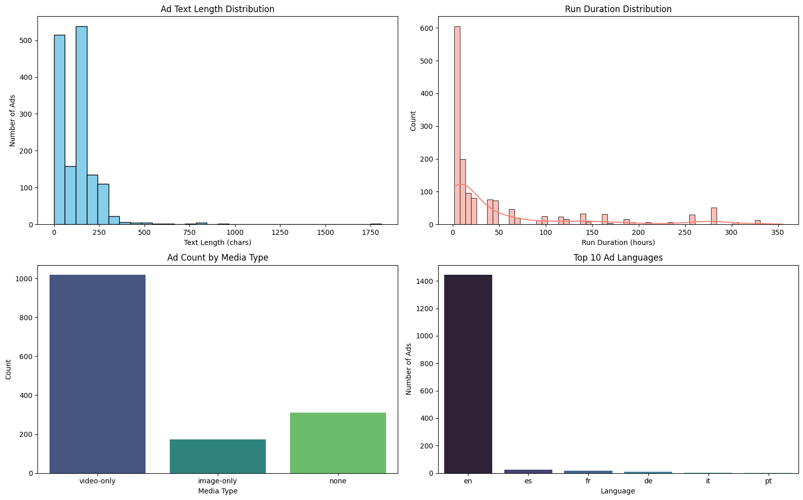
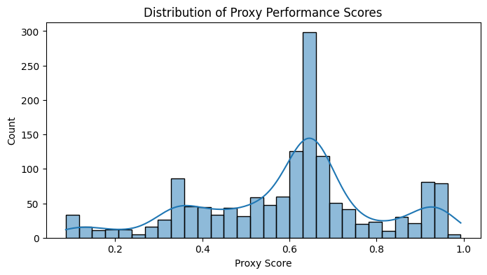

# Ad Pipeline

## 🚀 Overview

This project implements a complete data engineering pipeline to process **Facebook “microlearning” ads** in the **USA**. The pipeline scrapes ads using Playwright, parses and normalizes them into a consistent schema, enriches them with derived features, and ranks them by a **proxy performance score**.

---

## 📂 Project Structure

```
.
├── config.yaml                 # Configuration for scrapper, outputs
├── main.py                     # Main entry point for the pipeline
├── requirements.txt            # Python dependencies
├── data/
│   ├── analysis/
│   │   └── top_100_us_microlearning_ads.jsonl
│   ├── parsed/
│   │   └── us_microlearning_ads.jsonl
│   ├── quarantine/
│   │   └── us_microlearning_ads.jsonl
│   └── transformed/
│       └── us_microlearning_ads.jsonl
├── notebooks/
│   └── ads_analysis.ipynb      # Visualizations and exploratory analysis
├── schema/
│   └── __init__.py             # JSON Schema for validation
├── src/
    ├── ads_analysis.py         # Analysis and scoring logic
    ├── config.py               # Configuration loader
    ├── constants.py            # Global constants and selectors
    ├── logger.py               # Custom logging setup
    ├── parser.py               # HTML ad parser
    ├── scraper.py              # Playwright-based ad scraper
    ├── transformer.py          # Data cleaning and enrichment
    └── utils.py                # Helper utilities
```
---

## 💾 Installation

```bash
git clone <repo-url>
cd <repo-directory>

# Set up a virtual environment (optional but recommended)
python -m venv venv
source venv/bin/activate  # On Windows: venv\Scripts\activate

# Install dependencies
pip install -r requirements.txt
```

---

## ▶️ How to Run

1. **Configure Settings:** Edit `config.yaml` to adjust output paths, scrapping settings, and country filter (default is `"US"`).

2. **Run Pipeline:**

```bash
python main.py
```

The pipeline will:

- Scrape ads using Playwright
- Parse HTML into structured format
- Normalize & enrich data
- Save intermediate and final results to the `data/` folders

---

## 📊 Summary Report

### 📈 Proxy Performance Score

Each ad is enriched with a proxy performance score between 0 and 1, computed from multiple features believed to correlate with high engagement:

```
score = (
    0.35 * text_len_score        # favors lengths near 50 and 150 chars
  + 0.30 * media_mix_score       # video/image/both/none
  + 0.20 * is_active_score       # favors active ads
  + 0.15 * duration_score        # log-scaled runtime
)
```

#### Why This Score?



*US Microlearning Ads - Key Visualisations*

- 🔠 **Text Length**: Encourages concise yet informative text (two peaks at ~50 and ~150 characters).
- 🎞️ **Media Mix**: Favors video and mixed media ads, known for higher engagement.
- ✅ **Active Ads**: Ads currently running are more relevant and possibly higher-performing.
- ⏱️ **Duration**: Older ads may indicate ongoing performance, but the score is capped to avoid overweighting.



*US Microlearning Ads - Distribution of Proxy Performance Scores*

The distribution is unimodal with a single prominent peak observed between 0.65 and 0.7. This indicates that the dataset contains one primary group of ads based on their performance, with a concentration of ads achieving a higher average score.

---

### 🥇 Top 100 US Microlearning Ads

Top 100 US microlearning ads are saved to:

```
data/analysis/top_100_us_microlearning_ads.jsonl
```

They can be visualized with:

```
notebooks/ads_analysis.ipynb
```

---

*Top 10 US Microlearning Ads*

| library_id       | advertiser_name           | proxy_performance_score | ad_text_len | media_mix  | is_active | run_duration_hours |
|------------------|---------------------------|-------------------------|-------------|------------|-----------|--------------------|
| 2183923988727285 | Career Voice              | 0.9931                  | 156         | video-only | True      | 138.21             |
| 1532341091260933 | Career Voice              | 0.9931                  | 156         | video-only | True      | 138.21             |
| 1974988616372981 | Career Voice              | 0.9931                  | 156         | video-only | True      | 138.21             |
| 1261451765682672 | Career Voice              | 0.9931                  | 156         | video-only | True      | 138.21             |
| 1072888221114976 | BuildWitt                 | 0.9906                  | 157         | video-only | True      | 66.19              |
| 1269102717517732 | Learny: Daily Microlearning | 0.9536                  | 166         | video-only | True      | 42.18              |
| 1266052145165572 | Learny: Daily Microlearning | 0.9536                  | 166         | video-only | True      | 42.18              |
| 2311745779280839 | Learny: Daily Microlearning | 0.9536                  | 166         | video-only | True      | 42.18              |
| 769078018889763  | Learny: Daily Microlearning | 0.9536                  | 166         | video-only | True      | 42.18              |
| 3886412208247876 | Learny: Daily Microlearning | 0.9536                  | 166         | video-only | True      | 42.19              |

---
